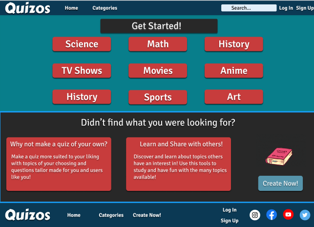
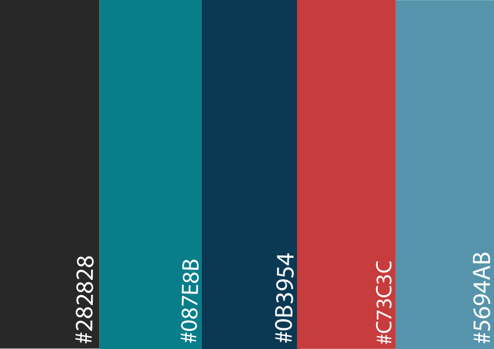

# Quizos
Quizos is a community-based web application for those looking for free entertainment, where users can partake in the various quizzes the site has to offer and maybe learn a thing or two!

Heavily Inspired by Quizlet and Quizizz who the developer believes are great sites for both entertainment and educational purposes. 

The sleek and quick to navigate design allows the user to go from quiz to quiz with minimum effort and easy to find specific quizzes the user may be looking for.

[Live Project Here!](https://ale-aparicio.github.io/Quizos/index.html)

# Table of Contents
1. [UX](#UX)
    1. [Project Goals](#Project-Goals)
    2. [User Stories](#User-Stories)
    3. [Development Planes](#Development-Planes)
3. [Features](#Features)
    1. [Design Features](#Design-Features)
    2. [Features to Implement in the Future](#Features-to-Implement-in-the-Future)
4. [Issues and Bugs](#Issues-and-Bugs)
5. [Technologies Used](#Technologies-Used)
    1. [Languages](#Languages)
    2. [Tools](#Tools)
    3. [Libraries](#Libraries)
6. [Testing](#Testing)
7. [Deployment](#Deployment)
    2. [Local Copy Creation](#Local-Copy-Creation)
8. [Credits](#Credits)
9. [Acknowledgements](#Acknowledgements)

# UX
## Project Goals
The Primary goal for Quizos was to provide a web-based aplication with an easy to navigate and easy to use design that was interactive to the user while utilizing the JavaScript Language to achieve this.

This is the Second of Four Mile Stone Projects the developer must complete during their Full Stack Development Program provided by The Code Institute.

The main requirements for the project were to build an Interactive Frontend web-application with interactive functionalities utilizing HTML5, CSS, and JavaScript.

## User Goals 
The user is looking for:
* Interactive Functionalities that compliment the theme and purpose of the website.

* Entertaining Quizzes with a grading system to check their knowledge on a certain topic. 

* An intuitive and aesthetically pleasing design.

## Developer Goals 
The Developer is looking to:
* Create an interactive quiz website for people looking to test their knowledge on a certain topic or just for a quick dose of entertainment.

* Demostrate their skill and knowledge of the usage of JavaScript.

* Deploy a project they are hapy and satisfied with.

# User Stories
As a General User, I want to :
* Be able to easy access quizzes.

* Be able to know what questions I got wrong and what my overall score for the quiz is.

* Test my knowledge on a variety of topics.

# Development Planes 
In order to design and create a good web-based application , the developer distinguished the required functionality of the site and how it would answer the users stories and demands. 

To accomplish this the developer went through a Development process:

## 1. Strategy 
They way the developer approached the design of this project was by addressing and ackowledging  the target audience:
* Demographic: 
    * Students Looking for a study tool
    * People bored and just looking for entertainment
    * Fans of specific genres looking to test their knowledge

The website needs to enable the user to:
* Take the quizzes without any problems

* Display whether they got the right or wrong answer and show which one question they got right or wrong.

* Display the final results of the quiz

## 2. Scope
A scope is utilized to identify what steps need to be taken in order to align the features with the strategy previously defined:

* Content Requirements
    * Variety of Subjects
        * Math
        * Science
        * Computers
        * Social Studies 
        * Languages
        * History
        * Movies 
        * Anime 
        * Sports
        * TV Shows 
        * Music 
        * Art
* Functionality Requirements
    * Quizes 
        * Quizes display the correct question
        * Quizes display 4 possible answer options 
        * Quizes display the correct answer
        * Quizes display the wrong answers
        * Quizes Display the total grade (0-100%)

# 3. Structure
The architecture of the webiste was design to ensure the user can navigate through the quizes and categories in a flawless and quick manner. 

The website is divided in 4 main sections:
1. The Home Page
    * Has some quick access links to some categories
2. Categories Section
    * Display all the available categories
3. The Category
    * Displays the available quizes
4. Quizes
    * Displays the questions and answer options

With the exception of the create page which is separate from the flow of the website since it isn't a currently integrated feature.
1. Create Page
    * Implemented in the future for users to create their own quizes.

# 4. Skeleton
Wireframe mockups were made in [Figma](https://www.figma.com/) to have a visual guide and ensure to provide a good user experience and a satisfying aesthetic.

The Home Page

The Categories Page

The Quiz page

The Create Page

## Design Changes: 
While the developer relied heavily on the wireframes designs in ordered to stay true to the original style and aesthetic of the website some changes were implemented to ensure the best user experience. 

* One of the biggest changes made was to the categories page where a scrolling header was added.

* The create theory was slightly altered The questions no longer have numbers as they will be randomly displayed rather than in a specific order and images will no longer be displayed inside the questions so the ability to add pictures to every question was removed.

* The Login and Sign in were changed from separate pages to small popups. 

# 5. Surface

* Color Scheme 
    * The colors scheme chosen was selected in order to give the webapp a relaxed and layed back aesthetic.

* Typograhpy 
    * The Primary font for this project is [Signika Negative](https://fonts.google.com/specimen/Signika+Negative?query=signika+ne).
    
    * The Font used for logo is [Carter One](https://fonts.google.com/specimen/Carter+One?query=carter+one)

# Features 
## Design Features
Each page of the website contains  a sleek and responsive navigation system:
* The Navbar contains links to all the main pages so that users have quick access to all of the important pages they will want to explore.
    * On Mobile the navbar transforms into a mobile friendly "hamburger" menu 

* The Footer just like the header contains contains all the necessary links aswell as some social links.
 
* The Home Page contains links to some of the available categories to get the user starter. It also contains a brief description about the create page as well as a link to the page itself.

* The Categories page contains links to all the categories available in the website aswell as an automatic scroll banner. 

* The Sub Categories page contains links to the actual quizes as well as a create button linked to the create page. 

* The Quizes consist of 10 questions each with 4 different to choose from.

## Features to Implement in the Future 
* **Data Base**
    * Implementing the use of a Data Base could take the user interactivity to another level by allowing our users to create an accound and giving them access to create their own theories.

    * As mentioned previosly users will be allowed to create their own quizes.

    * Another feature that could be implemented is the ability for users to favorite quizes and having the ability to acess said quizes directly from their profile making it more accessible.

[Back to top ⇧](#table-of-contents)

# Issues and Bugs
The developer encountered a number of issues during the development of the application, with the most important ones listed below.

* **Important** Since this project has been resubmitted a lingering problem across all 3 of the developer's Mile Stone Projects has been overlooked and only was only noticed during the third project. The commits on the project have been done in an unorthodox way causing the commits to all display "add" instead of the expected commit messages.

* The login and sign up pop up on the categories window has an issues that causes it to display behind the categories banner, the developer tried fixisng said issue but was unable to fix it as every attempt would deform, or render the banner useless.

[Back to top ⇧](#table-of-contents)

# Technologies Used 
## Languages 
* [HTML5](https://en.wikipedia.org/wiki/HTML)

* [CSS](https://en.wikipedia.org/wiki/CSS)

* [JavaScript](https://en.wikipedia.org/wiki/JavaScript)

## Tools
* **Gitpod**
    * Git Pod was used as the preferred IDE.

* [GitHub](https://github.com/)
    * Git Hub was used to store the project repository and to deploy the application.

* [Figma](https://www.figma.com/)
    * Used to create the wireframe during the design phase of the project.

* [Photoshop](https://www.photoshop.com/en)
    * To edit the website mockup, create the color pallette and edit the favicon.

* [Favicon](https://favicon.io/)
    * Used to create the icon displayed in the tab

* [Font Awesome](https://fontawesome.com/)
    * Used to add the icons used throughout the website

## Libraries
* [Bootstrap](https://getbootstrap.com/)
    * Used as the css framework used to implement the responsiveness of the site.

* [Google Fonts](https://fonts.google.com/)
    * Google fonts was used to import the "Piedra" and the "Pirata" fonts used throughout the website.

[Back to top ⇧](#table-of-contents)

# Testing 
[Live Project Here!](https://ale-aparicio.github.io/Quizos/index.html)

[View Repository](https://github.com/ale-aparicio/Quizos)

## Testing User Stories 
User theories were tested to ensure the expectations and needs of the users are met, this is the results of that test:

### General User
As a general user, I want to quickly access quizzes, and have no problem taking said quizzes:

* Quizzes have been put into easy to access categories so that the user has an easier time looking for specific types of quizzes depending on their preferences.

* Quizzes display wrong and right answer as well as show the overall grade to show directly show the user their progress.

## Manual Testing
Manual Testing of all elements was conducted by the developer, and the developer's friends and family to ensure all elements and features were working up to the user's standard.
### Common Element Testing 
Home Page:
* Checked all elements in the header and footer making sure all of them are linked to the appropriate windows.

* Checked all of the category links were linked to their respective categories.

* Checked that the create button directs the user to the create page.

Categories Page:
* Checked all of the categories are linked to their assigned sub-sections.

* Made sure all of the banner images are linked to their appropriate sub-sections.

Sub-Categories:
* Checked that each of the quizzes direct to the correct quiz with it's appropriate content. 

* The create button takes you to the create page.

Quiz Page:
* Ensured that the quizzes display the correct information. 

* Ensured that in all questions the right and wrong answered were displayed after the user made their choice.

* Checked that the results are displayed at the end of every test.

## Automated Testing

* The Html was run through the [W3C Validator](https://validator.w3.org/) and all errors marked were solved

* The CSS was tested through the [W3C CSS Validator](https://jigsaw.w3.org/css-validator/) and all errors marked were solved.

* The JS was tested using [Extends Class](https://extendsclass.com/javascript-fiddle.html) all errors displayed were 

## Browser Validator

* The Website was tested on the following browers and worked flawlessly:

Safari

Mozilla Firefox

Google Chrome

Internet Explorer

## User Testing

* Friends and family members all reviewed the website and pointed out spelling mistakes, bugs, and errors that they experiencing.

* All errors and complaints have been solved.

[Back to top ⇧](#table-of-contents)
# Credits 
## Content 
* The project is heavily inspired by [Quizlet](https://quizlet.com/).

* The quiz content was taken from [Quizizz](https://quizizz.com/join).

## Media 
* All of my images were taken from [Google Images](https://www.google.com/imghp?hl=EN) and so I don't really know where the actual sources of the different images are from.

# Acknowledgements 

* Thanks to my friends and family for helping with some of the ideas and design decisions when I was too indecisive or didn't know what to add into the website.

* Thanks to my mentor Seun Owonikoko for encouraging me to challenge myself to do the quiz website and for some design decisions and critizism. 

* Thanks to the Slack Community for answering questions and clearing my doubts.

* Last but not least Thanks to [Web Dev Simplified](https://www.youtube.com/channel/UCFbNIlppjAuEX4znoulh0Cw) for making great guides and tutorials that made making the quiz a much easier and not so daunting task.